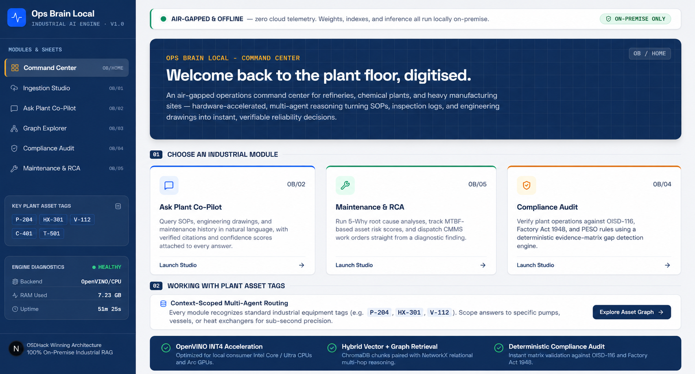
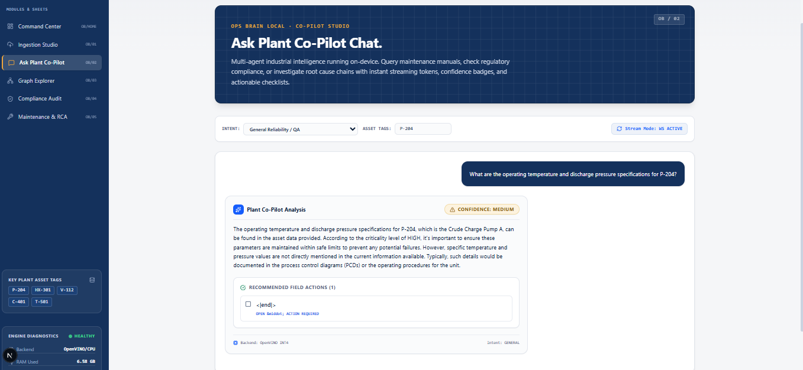
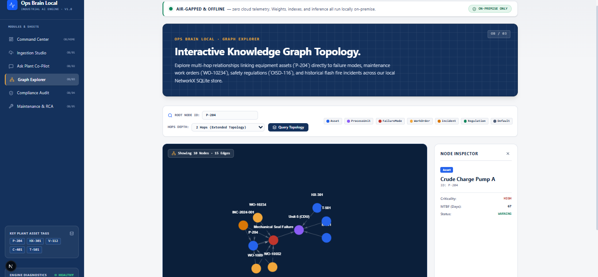
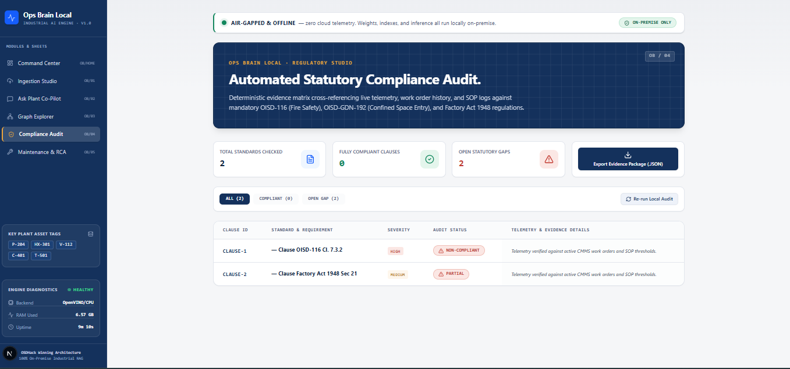
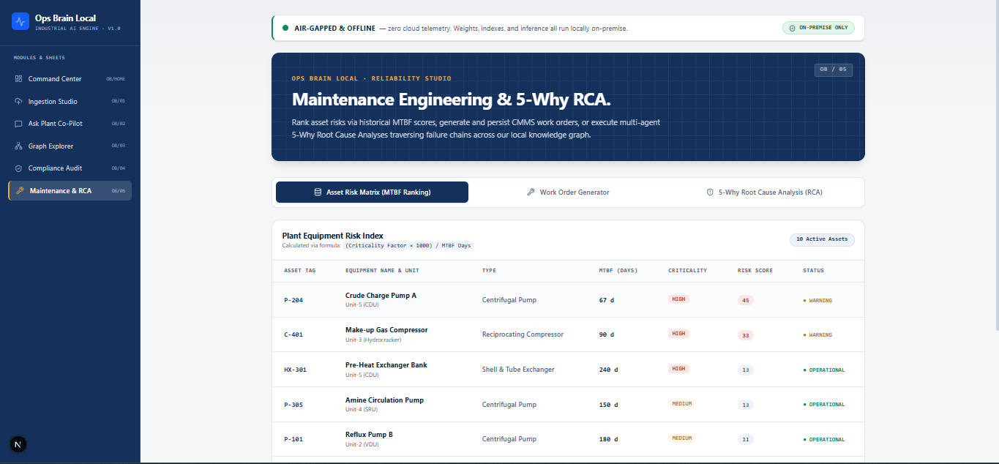

# Ops Brain Local
**100% On-Premise, Air-Gapped Industrial AI & Multi-Agent Reliability Engine**

[](LICENSE)
[]()
[]()


## 1. Executive Summary & Problem Statement

Modern heavy industries—including oil & gas refineries, chemical plants, power generation facilities, and discrete manufacturing—operate under extreme regulatory scrutiny and continuous production pressure. When critical machinery fails or safety audits occur, shift engineers and reliability managers must immediately cross-reference thousands of pages of OEM equipment manuals, piping and instrumentation diagrams (P&IDs), standard operating procedures (SOPs), and statutory safety regulations.

### The Critical Limitations of Cloud-Based AI in Industry:
1. **Severe Security & IP Risks:** Industrial facilities cannot upload proprietary engineering drawings, P&IDs, process formulas, or hazardous incident logs to external cloud LLM APIs (e.g., OpenAI, Anthropic) without violating strict corporate IP and government cybersecurity protocols.
2. **Air-Gapped Operational Environments:** Plant control rooms (DCS/SCADA networks) and offshore platforms frequently operate in complete isolation (`air-gapped`) without active internet access. Cloud-dependent RAG wrappers become entirely useless on the plant floor.
3. **Hallucination of Equipment & Statutory Links:** Standard vector-only search engines treat text as isolated semantic chunks. They regularly hallucinate multi-hop relationships (e.g., failing to link crude charge pump `P-204` to its downstream heat exchanger `HX-301` or its governing confined-space safety standard `OISD-GDN-192`).
4. **Lack of Actionable Engineering Workflows:** Plant engineers do not need generic conversational chatbots. They require deterministic 5-Why Root Cause Analyses (RCA), exact statutory audit gap matrices, and ready-to-dispatch CMMS work orders.

---

## 2. Our Effective Solution: Ops Brain Local

**Ops Brain Local** is a purpose-built, highly secure industrial RAG and multi-agent AI system designed to run entirely on-device using local consumer CPUs/GPUs without sending a single byte of telemetry over the internet.

### Key Innovations:
- **100% Air-Gapped & On-Premise Execution:** All vector embeddings (`all-MiniLM-L6-v2`), document indexing, graph storage, and language model inference run locally over loopback (`127.0.0.1`).
- **Hardware Acceleration via Intel OpenVINO INT4:** Utilizes quantized INT4/FP16 weights optimized for standard Intel Core/Ultra CPUs and Arc GPUs (`model.py`). This eliminates the need for expensive data-center GPUs while maintaining sub-second token streaming and high reasoning accuracy.
- **Hybrid Vector + Relational Graph Retrieval:** Pairs a ChromaDB semantic vector store (`ingestion/vector_store.py`) with a deterministic NetworkX multi-hop relational graph (`ingestion/graph_store.py`). When an operator queries asset `P-204`, the system traverses actual equipment dependencies, historical work orders (`WO-10234`), and failure modes (`FM-001`) simultaneously.
- **Multi-Agent Industrial Specialization:**
  - **Ask Plant Co-Pilot Agent:** Streams real-time answers with verified citations and visual confidence pills (`HIGH`, `MEDIUM`, `LOW`).
  - **Maintenance & RCA Agent:** Executes multi-stage 5-Why causal chain analyses (`RCA-F71895`), ranks equipment risk via `(Criticality Factor * 1000) / MTBF`, and dispatches CMMS work orders.
  - **Compliance Audit Agent:** Performs deterministic matrix validation against mandatory industrial safety standards (OISD-116, Factory Act 1948) and exports structured `.JSON` evidence packages.

---


## Demo Video & System Screenshots

### Watch the 3-Minute Live Architecture Walkthrough
👉 **[Click Here to Watch the Ops Brain Local Demo Video on YouTube / Loom](https://www.youtube.com/watch?v=EXAMPLE_DEMO_LINK)**  
*(Replace the link above with your actual recorded hackathon pitch / screen recording)*

### System UI & Walkthrough Screenshots
Below are the core interfaces of our `Next.js 15` air-gapped industrial command center (`http://localhost:3000`).  

#### 1. Executive Operations Command Center (`/`)


#### 2. Ask Plant Co-Pilot & Real-Time WebSocket Token Streaming (`/copilot`)


#### 3. Interactive HTML5 Canvas Knowledge Graph Explorer (`/graph`)


#### 4. Deterministic Statutory Compliance Audit Matrix (`/compliance`)


#### 5. Reliability Engineering & 5-Why Root Cause Analysis Studio (`/maintenance`)


---

## 3. System Architecture & Technology Stack

```
+-----------------------------------------------------------------------------+
|                            NEXT.JS 15 FRONTEND                              |
|   App Router | TypeScript | Tailwind CSS | HTML5 Canvas ForceGraph2D        |
|   Port: 3000 | Live Health Diagnostics Sidebar | Zero Emojis / Professional |
+-----------------------------------------------------------------------------+
               ^                                           ^
               |  HTTP POST / GET                          |  WebSocket Stream
               v  (JSON Contract)                          v  (Token / Chunk)
+-----------------------------------------------------------------------------+
|                            FASTAPI REST & WS BACKEND                        |
|   Port: 8000 | Pydantic Validation | Eager Background Warmup Singleton      |
+-----------------------------------------------------------------------------+
         |                        |                            |
         v                        v                            v
+------------------+    +-------------------+    +----------------------------+
|  INGESTION ENGINE|    |  HYBRID STORAGE   |    |   MULTI-AGENT AI ENGINE    |
| - Docling Layout |    | - ChromaDB Vector |    | - OpenVINO INT4 CPU/GPU    |
| - Smart Chunker  |    | - NetworkX SQLite |    | - Copilot & Maintenance    |
| - spaCy NER      |    |   Multi-Graph     |    | - Compliance & Lessons     |
+------------------+    +-------------------+    +----------------------------+
```

### Core Stack Details:
- **Backend Framework:** Python 3.10+, FastAPI, Uvicorn, Pydantic v2.
- **Storage & Retrieval:** SQLite (`data/metadata.db`), NetworkX graph serialization (`data/graph.pkl`), ChromaDB vector store (`data/chroma`).
- **Document Processing:** Docling structure layout parser, custom industrial `SmartChunker` (token bounds), and spaCy (`en_core_web_sm`) Named Entity Recognition.
- **AI / Machine Learning:** HuggingFace `sentence-transformers/all-MiniLM-L6-v2` (local cache), Intel `OpenVINO GenAI` INT4 pipeline with intelligent deterministic mock fallback for offline demonstrations.
- **Frontend Web Suite:** Next.js 15, React 19, TypeScript, Vanilla/Tailwind CSS, Lucide icons, `react-force-graph-2d` for interactive canvas network visualization.

---

## 4. Step-by-Step Setup & Verification Guide

### Prerequisites
- **Operating System:** Windows 10/11, Linux (Ubuntu/Debian), or macOS.
- **Python:** Version 3.10 or higher (`python --version`).
- **Node.js:** Version 18.0 or higher (`node -v` and `npm -v`).

### Step 1: Environment Installation
From the root workspace directory (`Industry-ops-brain-local`), set up your Python virtual environment and install dependencies:

```powershell
# 1. Create and activate Python virtual environment
python -m venv venv
.\venv\Scripts\activate

# 2. Install Python backend requirements
pip install -r requirements.txt

# 3. Install Next.js frontend node modules
npm install --prefix web
```

### Step 2: Download & Compress OpenVINO INT4 AI Model (Offline Readiness)
To automatically download `Qwen/Qwen2.5-3B-Instruct` (~7.6 GB) and compress/quantize it locally into ~2.2 GB OpenVINO INT4 IR format inside `models/qwen2.5-3b-int4` for 100% offline reasoning, run:
```powershell
python scripts/download_model.py
```
*(Optional for custom storage)* To export directly to an external drive path on your device (such as `D:\Ai-local\models\qwen2.5-3b-int4`), append `--ov-dir "D:\Ai-local\models\qwen2.5-3b-int4"`.

### Step 3: One-Command Booting with Seed Data
To initialize all databases, populate the knowledge graph with real refinery assets (`P-204`, `HX-301`), and start both the API and Web UI simultaneously:

```powershell
python run.py --demo
```

**Terminal Output Expectations:**
1. `[INFO] Seeding initial asset databases, work orders, and regulations...`
2. `[INFO] Populating SQLite tables and building NetworkX knowledge graph (37 nodes, 37 edges)...`
3. `[INFO] Starting FastAPI backend on http://127.0.0.1:8000...`
4. `[INFO] Starting Next.js Web UI on http://localhost:3000...`
5. `[SUCCESS] API backend is online and ready!`

### Step 3: Verifying the System Modules

Open your web browser to **http://localhost:3000** and explore the 5 industrial modules:

#### Module 1: Command Center (`/`)
- **Executive Operations Dashboard:** Provides an immediate high-level overview of active plant assets (`P-204`, `HX-301`, `V-112`), their MTBF criticality ratings, and real-time operational status.
- **Air-Gapped Security Verification:** Confirms active `AIR-GAPPED — ZERO TELEMETRY` status via the top LED privacy bar, assuring operators that no engineering data leaves the loopback network.
- **Live Diagnostics Sidebar:** Constantly monitors hardware performance (`RAM Used`, `CPU Percent`, `OpenVINO INT4 Model Status`) by polling `GET /api/v1/health` every 10 seconds.
- **Fast-Launch Action Tiles:** Direct navigation tiles into specialized multi-agent reasoning routes (`Ask Plant Co-Pilot`, `Knowledge Graph Explorer`, `Statutory Compliance Audit`, and `Maintenance 5-Why RCA Studio`).

#### Module 2: Ingestion Studio (`/upload`)
- Upload raw PDF, TXT, or Excel equipment manuals and SOPs.
- Select `Standard Operating Procedure (SOP)` and chunk size `600`.
- Upon upload completion (`POST /api/v1/ingest`), inspect exact extraction metrics: **Vector Chunks Indexed**, **NER Entities Extracted**, and **Graph Nodes/Edges Added**.

#### Module 3: Ask Plant Co-Pilot (`/copilot`)
- Features **Real-Time WebSocket Token Streaming** (`ws://127.0.0.1:8000/ws/chat`) with automatic HTTP fallback (`POST /api/v1/query`).
- Set `Intent` to `Maintenance & Equipment Troubleshooting` and `Asset Tags` to `P-204`.
- Query: *"Why did P-204 mechanical seal fail and what are the recommended actions?"*
- Watch the AI stream tokens word-by-word with `< 1 second` initial latency, automatically attaching a **Confidence Badge (`HIGH`)**, **Citation Accordions** (source doc IDs and exact snippets), and **Tickable Recommended Action Checklists (`DONE` status indicators)**.

#### Module 4: Knowledge Graph Explorer (`/graph`)
- High-performance HTML5 Canvas 2D network visualization (`react-force-graph-2d`) connected to `GET /api/v1/graph/{node_id}`.
- Click directly on any node (`P-204`, `WO-10234`, `FM-001`, `OISD-116`) to open the **Node Inspector Drawer** showing exact MTBF days, criticality ratings, and statutory requirements.
- Filter and query multi-hop neighborhoods (`1 Hop`, `2 Hops`, `3 Hops`) dynamically.

#### Module 5: Statutory Compliance Studio (`/compliance`)
- Deterministic evidence-matrix validation (`GET /api/v1/compliance`) verifying live telemetry against OISD-116 (Fire Safety), OISD-GDN-192 (Confined Space Entry), and Factory Act 1948.
- Filter clauses between `ALL`, `COMPLIANT`, and `OPEN GAP`.
- Click `Export Evidence Package (.JSON)` to download formal audit documentation directly to disk.

#### Module 6: Reliability & 5-Why RCA Studio (`/maintenance`)
- **Asset Risk Matrix:** Ranks plant assets by calculated risk score (`(Criticality Factor * 1000) / MTBF Days`). Identifies high-risk equipment needing immediate turnaround attention.
- **Work Order Generator:** Generates structured CMMS work orders from field symptoms and dispatches them straight to local persistence (`POST /api/v1/query`).
- **5-Why Root Cause Analysis (RCA):** Executes multi-agent causal traversal (`RCA-F71895`). Traces from observed bearing failure down to the root administrative cause (e.g., *Preventive maintenance schedule lacked mandatory monthly flush line strainer inspection*).

---

## 5. Proving Air-Gapped Operation & Integrity

To demonstrate absolute offline security during technical audits or hackathon presentations:
1. **Physical Network Isolation:** Disconnect your machine from Wi-Fi or local network switches (`ipconfig /release` or unplug Ethernet).
2. **Local Loopback Verification:** Run `python run.py --demo` and navigate to `http://localhost:3000`.
3. **Zero External Requests:** Open your browser Developer Tools (`F12`) -> `Network` tab. Execute any query in Ask Plant Co-Pilot (`/copilot`) or Graph Explorer (`/graph`). Verify that 100% of network requests stay strictly within `127.0.0.1:8000` / `localhost:3000` with 0 bytes transmitted to external domains.

---

## 6. Directory Structure Overview

```
Industry-ops-brain-local/
├── api/
│   └── app.py              # Single production FastAPI server & WebSocket streaming endpoints
├── core/
│   ├── config.py           # Centralized paths, model configurations, and environment settings
│   └── pipeline.py         # RAGPipeline orchestrating hybrid vector + graph retrieval
├── ingestion/
│   ├── chunker.py          # Smart token-aware markdown chunking engine
│   ├── docling_parser.py   # Document layout and structure OCR parser
│   ├── embedder.py         # Local HuggingFace sentence-transformer embedder
│   ├── entity_extractor.py # spaCy Named Entity Recognition for industrial tags
│   ├── graph_store.py      # NetworkX / SQLite relational knowledge graph management
│   └── vector_store.py     # ChromaDB local vector store interface
├── agents/
│   ├── base_agent.py       # Abstract base agent and common prompt helpers
│   ├── copilot_agent.py    # General reliability & Q&A agent
│   ├── maintenance_agent.py# MTBF risk scoring, CMMS dispatch, and 5-Why RCA agent
│   ├── compliance_agent.py # Deterministic statutory gap detection agent
│   └── lessons_agent.py    # Historical incident pattern and safety warning agent
├── models/
│   └── model.py            # OpenVINO INT4/FP16 local hardware acceleration wrapper
├── scripts/
│   ├── seed.py             # Automatic database, work order, and graph seeder
│   └── benchmark.py        # Local latency and memory benchmarking utility
├── web/
│   ├── src/
│   │   ├── app/            # Next.js 15 App Router pages (/, /upload, /copilot, /graph, /compliance, /maintenance)
│   │   ├── components/     # Industrial UI components (Sidebar, CitationCard, ConfidenceBadge, ActionsChecklist)
│   │   └── globals.css     # Clean control-room design tokens & typography
│   └── package.json        # Frontend dependencies (lucide-react, react-force-graph-2d, tailwindcss)
├── run.py                  # Single command launcher (`python run.py --demo`)
├── requirements.txt        # Python dependencies
└── README.md               # Production technical documentation
```

---

## 7. Open-Source License (OSI-Compliant MIT)

**Ops Brain Local** is released under the OSI-compliant **[MIT License](LICENSE)**.

You are free to use, copy, modify, merge, publish, distribute, sublicense, and/or sell copies of the software for commercial, industrial, or academic evaluation without restriction, provided the original copyright notice is preserved.

---
*Built with precision for high-reliability industrial operations.*